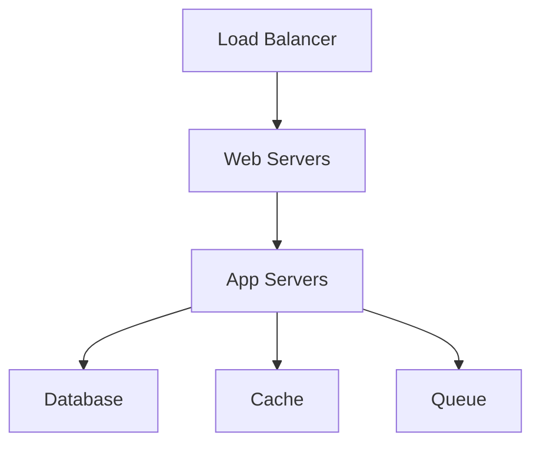

# Ansible Solution Specification Template

**Project Name**: {{ project_name }}  
**Date**: {{ date }}  
**Version**: {{ version }}  
**Author**: {{ author }}

## Executive Summary

{{ brief_description }}

**Key Objectives**:
1. {{ objective_1 }}
2. {{ objective_2 }}
3. {{ objective_3 }}

**Success Criteria**:
- {{ success_criterion_1 }}
- {{ success_criterion_2 }}
- {{ success_criterion_3 }}

## Infrastructure Requirements

### Environment Overview
- **Type**: {{ environment_type }}
- **Provider**: {{ cloud_provider | on_premise }}
- **Regions**: {{ regions }}
- **Availability Zones**: {{ availability_zones }}

### Server Specifications

| Role | Environment | Count | vCPU | RAM | Storage | OS |
|------|------------|-------|------|-----|---------|-----|
| {{ server_role }} | Production | {{ count }} | {{ vcpu }} | {{ ram }} | {{ storage }} | {{ os }} |

### Network Architecture
```
{{ network_diagram }}
```

**Network Requirements**:
- VPC CIDR: {{ vpc_cidr }}
- Public Subnets: {{ public_subnets }}
- Private Subnets: {{ private_subnets }}
- Load Balancer Type: {{ lb_type }}

## Application Stack

### Core Components

#### Web Tier
- **Server**: {{ web_server }}
- **Version**: {{ web_version }}
- **Configuration**: {{ web_config_notes }}

#### Application Tier
- **Runtime**: {{ app_runtime }}
- **Framework**: {{ app_framework }}
- **Version**: {{ app_version }}

#### Data Tier
- **Primary Database**: {{ db_type }}
- **Version**: {{ db_version }}
- **Clustering**: {{ clustering_approach }}
- **Caching**: {{ cache_solution }}

### Service Dependencies


## Security & Compliance

### Access Control
- **SSH Access**: {{ ssh_approach }}
- **API Authentication**: {{ api_auth }}
- **Service Accounts**: {{ service_account_strategy }}

### Secrets Management
- **Tool**: {{ secrets_tool }}
- **Rotation Policy**: {{ rotation_frequency }}
- **Encryption**: {{ encryption_approach }}

### Compliance Requirements
- [ ] {{ compliance_standard_1 }}
- [ ] {{ compliance_standard_2 }}
- [ ] {{ compliance_standard_3 }}

### Security Measures
| Layer | Protection |
|-------|------------|
| Network | {{ network_security }} |
| Application | {{ app_security }} |
| Data | {{ data_security }} |

## High Availability & Performance

### Availability Target
- **SLA**: {{ sla_percentage }}
- **Allowed Downtime**: {{ allowed_downtime }}
- **Maintenance Windows**: {{ maintenance_schedule }}

### Scaling Strategy
```
{{ scaling_approach }}
```

### Performance Targets
| Metric | Target | Measurement |
|--------|--------|-------------|
| Response Time | {{ response_time }} | 95th percentile |
| Throughput | {{ throughput }} | requests/second |
| Concurrent Users | {{ concurrent_users }} | peak load |

### Disaster Recovery
- **RTO**: {{ rto }}
- **RPO**: {{ rpo }}
- **Backup Strategy**: {{ backup_approach }}
- **Failover Method**: {{ failover_method }}

## Operations & Monitoring

### Logging Architecture
```
{{ logging_flow }}
```

- **Log Aggregation**: {{ log_tool }}
- **Retention**: {{ log_retention }}
- **Analysis**: {{ log_analysis }}

### Monitoring Stack
- **Metrics**: {{ metrics_tool }}
- **Alerts**: {{ alerting_tool }}
- **Dashboards**: {{ dashboard_tool }}

### Key Metrics
| Component | Metrics | Alert Threshold |
|-----------|---------|-----------------|
| {{ component }} | {{ metrics }} | {{ threshold }} |

### Operational Procedures
1. **Deployment Process**: {{ deployment_process }}
2. **Rollback Plan**: {{ rollback_plan }}
3. **Incident Response**: {{ incident_process }}

## Implementation Approach

### Phase 1: Foundation (Week 1-2)
- [ ] Set up infrastructure
- [ ] Configure networking
- [ ] Implement security baselines

### Phase 2: Core Services (Week 3-4)
- [ ] Deploy databases
- [ ] Set up application servers
- [ ] Configure load balancing

### Phase 3: Operations (Week 5-6)
- [ ] Implement monitoring
- [ ] Set up logging
- [ ] Configure backups

### Ansible Project Structure
```
{{ ansible_structure }}
```

### Key Roles to Develop
1. **{{ role_1 }}**: {{ role_1_purpose }}
2. **{{ role_2 }}**: {{ role_2_purpose }}
3. **{{ role_3 }}**: {{ role_3_purpose }}

## Validation Plan

### Testing Strategy
1. **Unit Tests**: Test individual roles with Molecule
2. **Integration Tests**: Test complete playbooks
3. **Performance Tests**: Validate against targets
4. **Security Tests**: Run compliance scans

### Acceptance Criteria
- [ ] All automated tests pass
- [ ] Performance targets met
- [ ] Security scan clean
- [ ] Documentation complete
- [ ] Runbooks tested

## Risk Assessment

| Risk | Impact | Probability | Mitigation Strategy |
|------|--------|-------------|-------------------|
| {{ risk_1 }} | {{ impact_1 }} | {{ prob_1 }} | {{ mitigation_1 }} |
| {{ risk_2 }} | {{ impact_2 }} | {{ prob_2 }} | {{ mitigation_2 }} |

## Out of Scope

The following items are explicitly out of scope for this phase:
- {{ out_of_scope_1 }}
- {{ out_of_scope_2 }}
- {{ out_of_scope_3 }}

## Future Considerations

Items to consider for future phases:
1. {{ future_item_1 }}
2. {{ future_item_2 }}
3. {{ future_item_3 }}

## Appendices

### A. Cost Estimates
{{ cost_breakdown }}

### B. Reference Architecture
{{ reference_links }}

### C. Glossary
| Term | Definition |
|------|------------|
| {{ term }} | {{ definition }} |

## Sign-off

| Role | Name | Date |
|------|------|------|
| Technical Lead | {{ tech_lead }} | {{ date }} |
| Project Manager | {{ pm }} | {{ date }} |
| Security | {{ security_approver }} | {{ date }} |